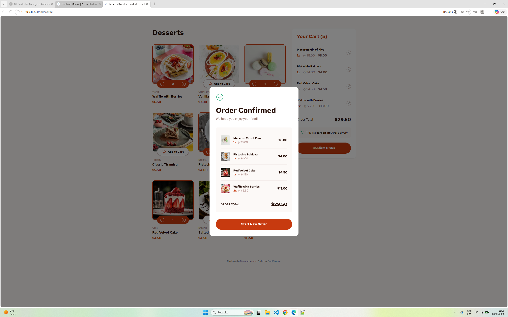

# Frontend Mentor - Product list with cart solution

This is a solution to the [Product list with cart challenge on Frontend Mentor](https://www.frontendmentor.io/challenges/product-list-with-cart-5MmqLVAp_d). 

## Table of contents

- [Overview](#overview)
  - [The challenge](#the-challenge)
  - [Screenshot](#screenshot)
  - [Links](#links)
- [My process](#my-process)
  - [Built with](#built-with)
  - [What I learned](#what-i-learned)
  - [Continued development](#continued-development)
  - [AI Collaboration](#ai-collaboration)
- [Author](#author)

## Overview

### The challenge

Users should be able to:

- Add items to the cart and remove them.
- Increase/decrease the number of items in the cart with automatic total calculation.
- See an order confirmation modal with a summary of the purchase.
- Reset the application state when clicking "Start New Order".
- View an optimized and responsive layout for mobile, tablet, and desktop.

### Screenshot



### Links

- Solution URL: [https://github.com/carolsalome/seu-repositorio](https://github.com/carolsalome/ecommerce-with-cart)
- Live Site URL: [https://seu-projeto.vercel.app](https://ecommerce-with-cart-six.vercel.app/)

## My process

### Built with

- Semantic HTML5 markup
- **Tailwind CSS** (Utility-first CSS framework)
- **JavaScript (ES6+)** - Dynamic DOM manipulation
- **JSON Data Fetching** - Asynchronous data loading
- Mobile-first workflow
- Google Fonts (Red Hat Text)

### What I learned

This project was essential for understanding how to manage the **Application State** using Vanilla JavaScript. I learned how to synchronize the "Product List" with a "Shopping Cart" array.

One part I'm proud of is the logic to toggle between the "Add to Cart" button and the "Quantity Selector":

```javascript
// Dynamic button rendering based on cart state
${!isInCart ? `
    <button onclick="addToCart('${product.name}')" class="btn-add">
        Add to Cart
    </button>
` : `
    <div class="quantity-selector">
        <button onclick="updateQuantity('${product.name}', -1)">-</button>
        <span>${cartItem.quantity}</span>
        <button onclick="updateQuantity('${product.name}', 1)">+</button>
    </div>
`}